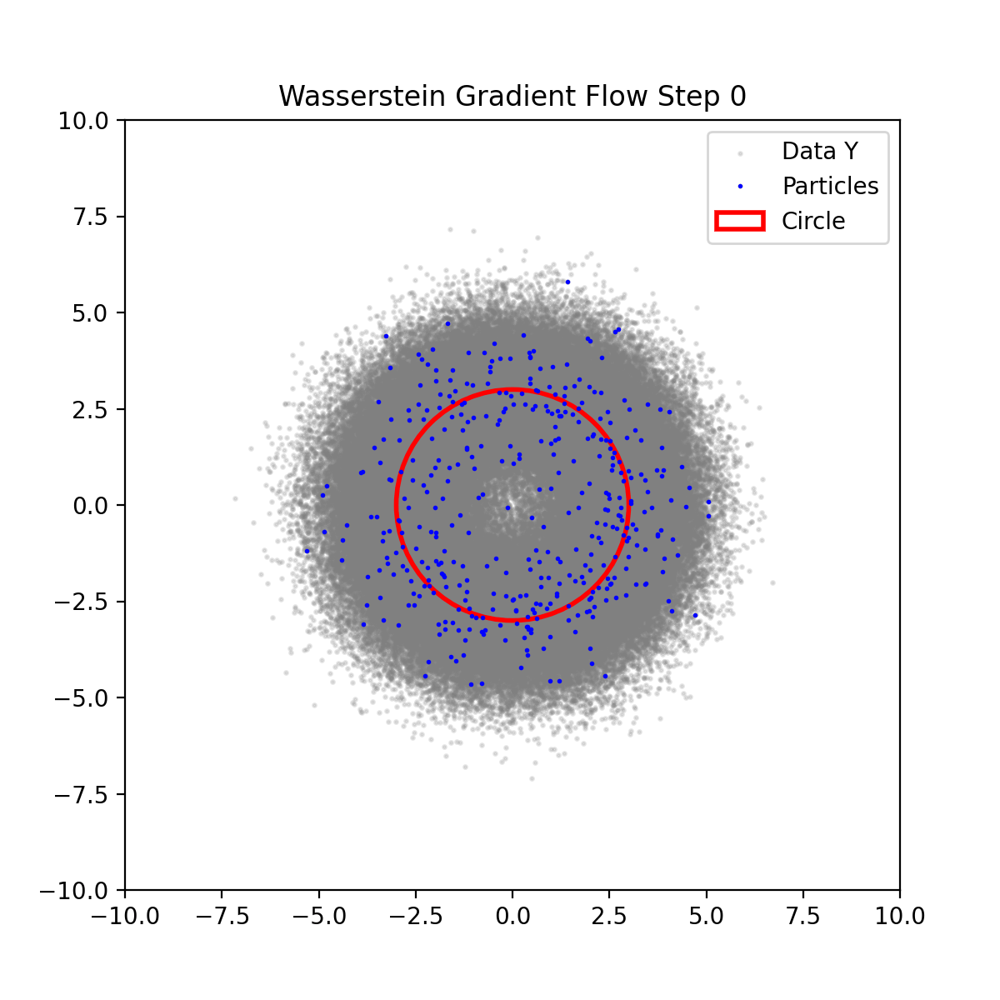

# Math
Random math scripts

## Empirical Bayes
Wasserstein gradient flow for the empirical Bayes model: Yᵢ = θᵢ + εᵢ, where θᵢ are points sampled uniformly from the perimeter of a circle and εᵢ are standard normal noise vectors. At each iteration, the particles x₁,…,xₘ are updated according to:

xᵢ ← xᵢ - (1/n) × Σₖ [ ∇φ(Yₖ - xᵢ) / ( (1/m) × Σₗ φ(Yₖ - xₗ) ) ]

where φ is the RBF kernel and the sums run over all observed data points (k=1…n) and all particles (l=1…m).

## Throwing eggs from a building
Given n eggs and an M-floor building, find the minimum number of egg throws to identify the lowest floor at which eggs break.

## How many steps to bingo?
Given an n x n bingo card, each step a random empty cell gets marked. How many steps are needed to get a bingo, on average?

Answer: $n^2 - n \log(n)$.

The answer $n^2 - n \log(n)$ was given by ChatpGPT-o1-mini in *one-shot*.
