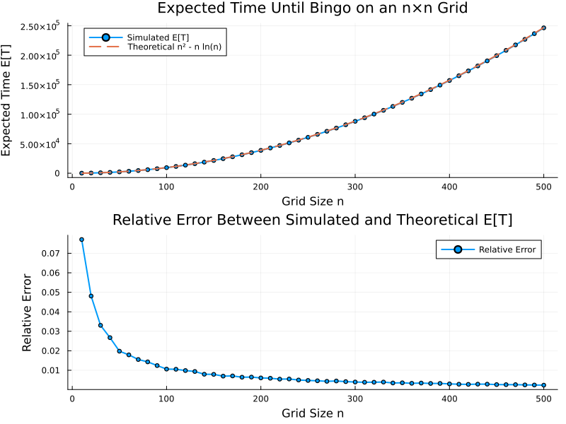

# Math
Random math scripts

## Throwing eggs from a building
Given n eggs and an M-floor building, find the minimum number of egg throws to identify the lowest floor at which eggs break.

## How many steps to bingo?
Given an n x n bingo card, each step a random empty cell gets marked. How many steps are needed to get a bingo, on average?

Answer: $n^2 - n \log(n)$.

The answer $n^2 - n \log(n)$ was given by ChatpGPT-o1-mini in *one-shot*.
